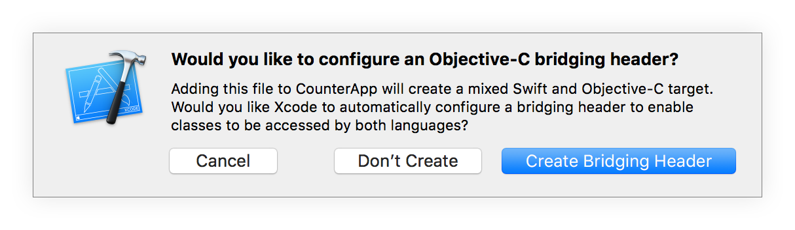
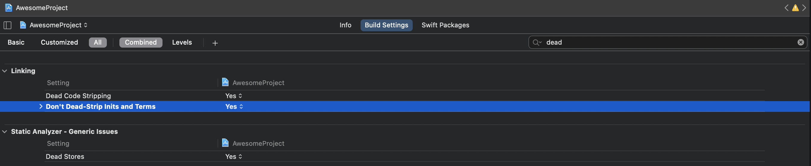
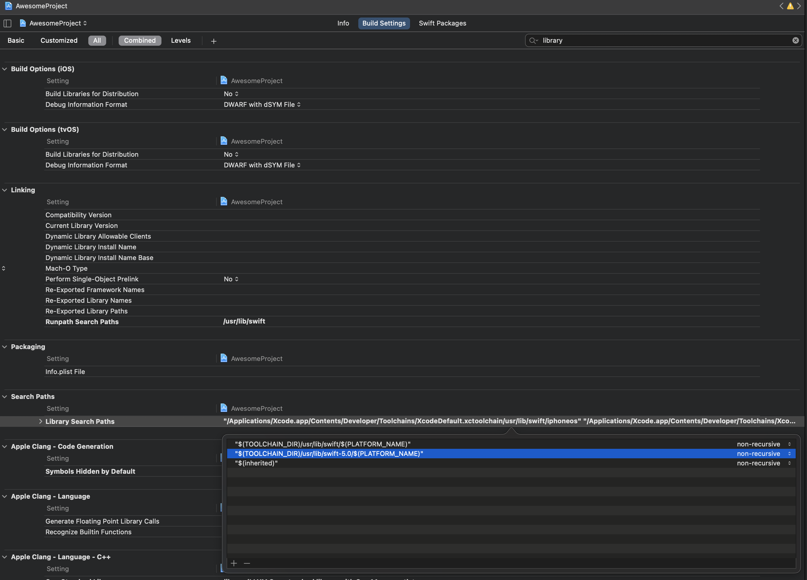

# React Native Mapbox Navigation


Smart Mapbox turn-by-turn routing based on real-time traffic for React Native. A navigation UI ready to drop into your React Native application. [Sample demo usage shown here for the HOMEE Pro iOS app in the screenshot](https://www.homee.com/) ➡️

## Features

- A full-fledged turn-by-turn navigation UI for iPhone, iPad, and CarPlay that’s ready to drop into your application
- [Professionally designed map styles](https://www.mapbox.com/maps/) for daytime and nighttime driving
- Worldwide driving, cycling, and walking directions powered by [open data](https://www.mapbox.com/about/open/) and user feedback
- Traffic avoidance and proactive rerouting based on current conditions in [over 55 countries](https://docs.mapbox.com/help/how-mapbox-works/directions/#traffic-data)
- Natural-sounding turn instructions powered by [Amazon Polly](https://aws.amazon.com/polly/) (no configuration needed)
- Support for over two dozen languages

## Installation Requirements

Before installing the SDK, you will need to gather the appropriate credentials. The SDK requires two pieces of sensitive information from your Mapbox account. If you don't have a Mapbox account: [sign up](https://account.mapbox.com/auth/signup/) and navigate to your [Account page](https://account.mapbox.com/). You'll need:

- **A public access token**: From your account's [tokens page](https://account.mapbox.com/access-tokens/), you can either copy your _default public token_ or click the **Create a token** button to create a new public token.
- **A secret access token with the `Downloads:Read` scope**.

1. From your account's [tokens page](https://account.mapbox.com/access-tokens/), click the **Create a token** button.
1. From the token creation page, give your token a name and make sure the box next to the `Downloads:Read` scope is checked.
1. Click the **Create token** button at the bottom of the page to create your token.
1. The token you've created is a _secret token_, which means you will only have one opportunity to copy it somewhere secure.

## Installation

```
npm install @homee/react-native-mapbox-navigation
```

Read the iOS specific instructions below before running `pod install`.

---

### iOS Specific Instructions

Make sure your react native project has an Objective-C bridging header for swift. If you don't have a bridging header you can follow these steps here below in the dropdown.

<details>
<summary>
  Create an Objective-C bridging header
</summary>

1. From Xcode, go to: <br>
   File → New → File…
1. Select Swift File
1. Name your file Dummy or whatever you want
1. In the Group dropdown, make sure to select the group folder for your app, not the project itself.

After you create the Swift file, you should be prompted to choose if you want to configure an Objective-C Bridging Header. Select “Create Bridging Header”.



This file is usually named YourProject-Bridging-Header.h. Don’t change this name manually, because Xcode configures the project with this exact filename.

</details>

There are a few build settings in Xcode that are necessary. Make sure to set `Don't Dead-strip Inits and Terms` to `YES` and `Dead Code Stripping` to `YES` for all projects/targets.

<details>
<summary>
Build Settings Screenshot 1
</summary>



</details>

You will also need to remove the entry `"$(TOOLCHAIN_DIR)/usr/lib/swift-5.0/$(PLATFORM_NAME)"` from `Library Search Paths` if it is present for your project target -

<details>
<summary>
Build Settings Screenshot 2
</summary>



</details>

Place your public token in your Xcode project's `Info.plist` and add a `MBXAccessToken` key whose value is your public access token.

NOTE: `MGLMapboxAccessToken` is deprecated, now you should use `MBXAccessToken` instead

Add the `UIBackgroundModes` key to `Info.plist` with `audio` and `location` if it is not already present. This will allow your app to deliver audible instructions while it is in the background or the device is locked.

```
<key>UIBackgroundModes</key>
<array>
  <string>audio</string>
  <string>location</string>
</array>
```

Place your secret token in a `.netrc` file in your OS home directory that contains this:

```
machine api.mapbox.com
login mapbox
password <INSERT SECRET TOKEN>
```

Add the following to your ios podfile -

```ruby
  pre_install do |installer|
    $RNMBNAV.pre_install(installer)
    # any other pre install hooks here
  end

  post_install do |installer|
    $RNMBNAV.post_install(installer)
    # any other post install hooks here
  end
```

<details>
<summary>podfile example</summary>

```ruby
require_relative '../node_modules/react-native/scripts/react_native_pods'
require_relative '../node_modules/@react-native-community/cli-platform-ios/native_modules'

platform :ios, '10.0'
install! 'cocoapods', :disable_input_output_paths => true

target 'AwesomeProject' do
  config = use_native_modules!

  use_react_native!(:path => config["reactNativePath"])

  target 'AwesomeProjectTests' do
    inherit! :complete
    # Pods for testing
  end

  pre_install do |installer|
    $RNMBNAV.pre_install(installer)
  end

  # Enables Flipper.
  #
  # Note that if you have use_frameworks! enabled, Flipper will not work and
  # you should disable these next few lines.
  use_flipper!
  post_install do |installer|
    flipper_post_install(installer)
    $RNMBNAV.post_install(installer)
  end
end

target 'AwesomeProject-tvOS' do
  # Pods for AwesomeProject-tvOS

  target 'AwesomeProject-tvOSTests' do
    inherit! :search_paths
    # Pods for testing
  end
end
```

</details>

Now you are ready to install the cocoapod:

```
cd ios && pod install
```

If you are experiencing a _"multiple commands produce"_ build error in your Xcode project then you will need to add this entry below to the top of your ios podfile:

`install! 'cocoapods', :disable_input_output_paths => true`

If you are having an issue with your archive not showing up in organizer after archiving then you will need to open `ios/Pods/Target Support Files/@react-native-mapbox-gl-mapbox-static/@react-native-mapbox-gl-mapbox-static-copy-dsyms.sh` and comment out lines 85 thru 89 -

<details>
<summary>
Lines 85 thru 89
</summary>

```sh
#install_dsym "${PODS_ROOT}/@react-native-mapbox-gl-mapbox-static/dynamic/MapboxMobileEvents.framework.dSYM"
#install_bcsymbolmap "${PODS_ROOT}/@react-native-mapbox-gl-mapbox-static/dynamic/93C58D95-90B9-30C8-8F60-4BDE32FD7E8E.bcsymbolmap"
#install_bcsymbolmap "${PODS_ROOT}/@react-native-mapbox-gl-mapbox-static/dynamic/BB87D8DD-493F-37AA-BD21-2BC609B8311B.bcsymbolmap"
#install_bcsymbolmap "${PODS_ROOT}/@react-native-mapbox-gl-mapbox-static/dynamic/B184533A-B4A2-3D2F-AD72-A6C33D9914F4.bcsymbolmap"
#install_bcsymbolmap "${PODS_ROOT}/@react-native-mapbox-gl-mapbox-static/dynamic/E2FE4B9E-73E5-34BF-B8B9-8FECEBE04D8D.bcsymbolmap"
```

</details>

For more information you can read the [docs provided by Mapbox](https://docs.mapbox.com/ios/navigation/overview/#configure-credentials).

---

### Android Specific Instructions

Place your secret token in your android app's top level `gradle.properties` file:

```
MAPBOX_DOWNLOADS_TOKEN=SECRET_TOKEN_HERE
```

Open up your _project-level_ `build.gradle` file. Declare the Mapbox Downloads API's `releases/maven` endpoint in the `repositories` block.

```gradle
allprojects {
    repositories {
        maven {
            url 'https://api.mapbox.com/downloads/v2/releases/maven'
            authentication {
                basic(BasicAuthentication)
            }
            credentials {
                // Do not change the username below.
                // This should always be `mapbox` (not your username).
                username = "mapbox"
                // Use the secret token you stored in gradle.properties as the password
                password = project.properties['MAPBOX_DOWNLOADS_TOKEN'] ?: ""
            }
        }
    }
}
```

Place your public token in your project's `android/app/src/main/AndroidManifest.xml`

```xml
<!-- This should be a child of the application tag -->
<meta-data android:name="MAPBOX_ACCESS_TOKEN"
    android:value="PUBLIC_TOKEN_HERE" />
```

For more information you can read the [docs provided by Mapbox](https://docs.mapbox.com/android/navigation/overview/#configure-credentials).

## Usage

```jsx
import * as React from "react";
import { StyleSheet, View } from "react-native";
import MapboxNavigation from "@homee/react-native-mapbox-navigation";

export const SomeComponent = () => {
  return (
    <View style={styles.container}>
      <MapboxNavigation
        origin={[-97.760288, 30.273566]}
        destination={[-97.918842, 30.494466]}
        shouldSimulateRoute
        showsEndOfRouteFeedback
        onLocationChange={(event) => {
          const { latitude, longitude } = event.nativeEvent;
        }}
        onRouteProgressChange={(event) => {
          const {
            distanceTraveled,
            durationRemaining,
            fractionTraveled,
            distanceRemaining,
          } = event.nativeEvent;
        }}
        onError={(event) => {
          const { message } = event.nativeEvent;
        }}
        onCancelNavigation={() => {
          // User tapped the "X" cancel button in the nav UI
          // or canceled via the OS system tray on android.
          // Do whatever you need to here.
        }}
        onArrive={() => {
          // Called when you arrive at the destination.
        }}
      />
    </View>
  );
};

const styles = StyleSheet.create({
  container: {
    flex: 1,
  },
});
```

### `MapboxNavigation` Props

#### `origin` (**Required**)

Array that contains the longitude and latitude for the starting point.<br>
`[$longitude, $latitude]`

#### `destination` (**Required**)

Array that contains the longitude and latitude for the destination point.<br>
`[$longitude, $latitude]`

#### `shouldSimulateRoute`

Boolean that controls route simulation. Set this as `true` to auto navigate which is useful for testing or demo purposes. Defaults to `false`.

#### `showsEndOfRouteFeedback`

Boolean that controls showing the end of route feedback UI when the route controller arrives at the final destination. Defaults to `false`. Currently this prop is only available for iOS as the Android Mapbox SDK does not support drop-in UI for this functionality. Will need to implement this manually in Android.

#### `mute`

Boolean that toggles voice instructions. Defaults to `false`.

#### `hideStatusView`

Boolean that controls showing the `StatusView` (iOS only). This is the transparent black bar with the "Simulating Navigation" text shown in the above screenshot. Defaults to `false`.

#### `onLocationChange`

Function that is called frequently during route navigation. It receives `latitude` and `longitude` as parameters that represent the current location during navigation.

#### `onRouteProgressChange`

Function that is called frequently during route navigation. It receives `distanceTraveled`, `durationRemaining`, `fractionTraveled`, and `distanceRemaining` as parameters.

#### `onError`

Function that is called whenever an error occurs. It receives a `message` parameter that describes the error that occurred.

#### `onCancelNavigation`

Function that is called whenever a user cancels navigation.

#### `onArrive`

Function that is called when you arrive at the provided destination.

## Contributing

Contributions are very welcome. Please check out the [contributing document](CONTRIBUTING.md).

## License

The source code in this library is [MIT](LICENSE) licensed. The usage of this library will fall under Mapbox terms (this library downloads Mapbox SDKs and uses that closed source in conjunction with the open source code here).
